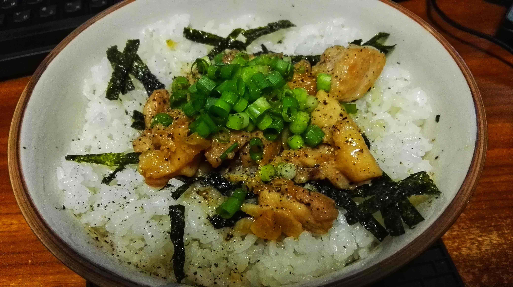

# 料理名
かしわバター丼(再現アレンジ)

## タグ
肉, こってり, がっつり, 丼もの

## 説明
香川県高松市の「[武内食堂](https://tabelog.com/kagawa/A3701/A370101/37000846/)」で提供している「かしわバター丼」の再現レシピのアレンジ版。  
玉ねぎでかさ増ししてボリュームアップ。  
ちなみに再現レシピのオリジナルは[ここ](http://ameblo.jp/dirty-oyaji/entry-10630436501.html)。

香川県に行ったときに食べたのが美味しすぎて自宅でも作ってみた。  
一度食べたら病みつきになるジャンキーな美味しさ。

## 材料(1-2人前)
### ・仕込み

|材料名|分量|補足事項|
|:----:|:--:|:------:|
|鶏もも肉|200-300g||
|スライスにんにく|2片ぶん||
|すりおろし生姜|少々||
|醤油|大さじ2||
|酒|大さじ1||

### ・その他

|材料名|分量|補足事項|
|:----:|:--:|:------:|
|玉ねぎ|半分-1個||
|粗挽き黒胡椒|適量||
|バター|40g||
|刻みネギ|お好み||
|刻み海苔|お好み||

## 手順

### 1. もも肉を1~2cm角に切る

### 2. にんにく，生姜，酒，醤油に肉を30分以上漬け込む

### 3. 熱したフライパンにバターを入れて玉ねぎを炒める

### 4. 漬け込んだ肉をタレごとフライパンに入れ，中火で炒める

### 5. 肉に火が通ったら黒胡椒を加えて水気が減るまで炒める。入れ過ぎかな?と思うくらいガッと入れたほうが丁度いい。

### 6. どんぶりにご飯を盛り，刻み海苔を敷く

### 7. 具材をご飯の上に載せ，刻み海苔をふりかける

### 8. 完成
