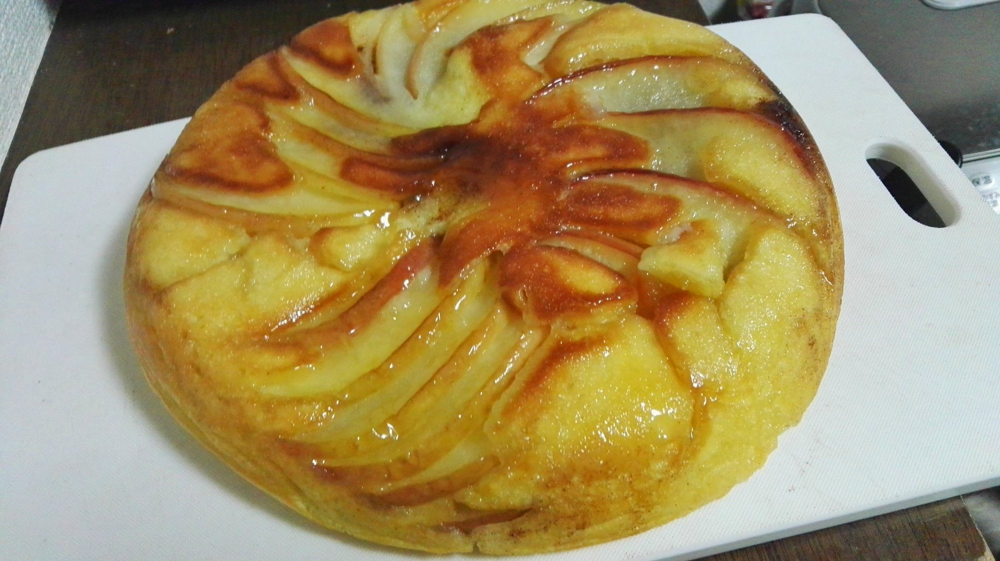

# 料理名
タルトタタン風ケーキ

## タグ
スイーツ

## 説明
シナモン入りのタルトタタン風ホットケーキ

## 材料(2〜4人前)

### ホットケーキミックス
|材料名|分量|補足事項|
|:----:|:--:|:------:|
|薄力粉|大さじ6||
|強力粉|大さじ5||
|砂糖|大さじ2||
|ベーキングパウダー|小さじ2||
|塩|ひとつまみ||

### その他
|材料名|分量|補足事項|
|:----:|:--:|:------:|
|リンゴ|1/2個||
|卵|1個||
|牛乳|150ml|水でもok|
|バター|30g||
|砂糖|大さじ2||
|シナモン|大さじ1||

## 手順

### 1. フライパンを弱火にかけ，バターと砂糖を焦げないように炒める

### 2. ふつふつしてきたら火を止めて，くし切りにしたリンゴを敷き詰める

### 3. シナモンを全体的にふりかける

### 4. ホットケーキミックスの材料に牛乳を少しずつ加えながら混ぜ合わせる

### 5. 粉が溶け切ったら卵を加えて更に混ぜる

### 6. 5をフライパンに流し入れ，蓋を閉じて中火で3分焼く

### 7. 3分たったら弱火にして10分焼く

### 8. 箸を刺して何も付かなければ皿かまな板にあける

### 9. 冷ましたら完成
